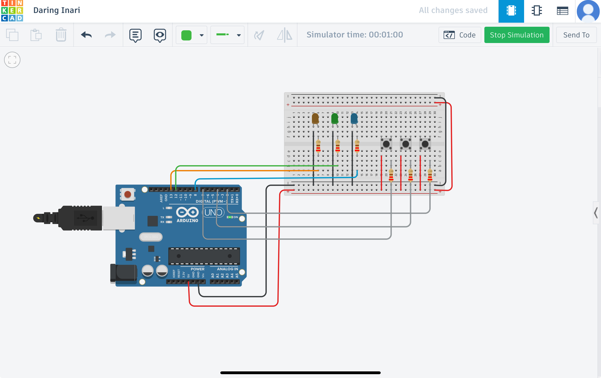
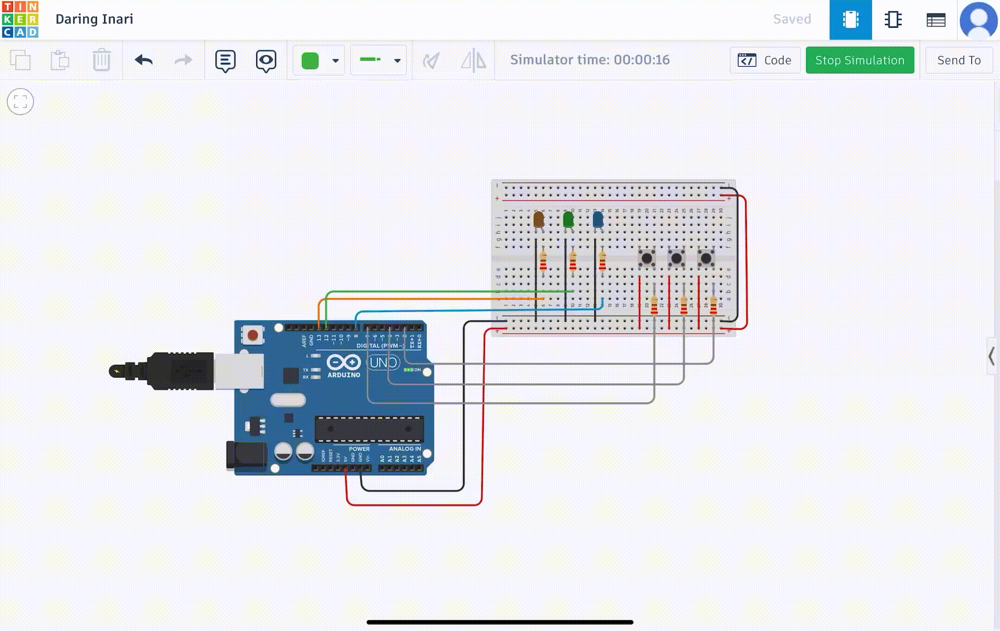

# Arduino_LED_Buttons
## Project Description
This is a simple Arduino project that uses three push buttons to control three LEDs. 
Each button turns on a specific LED when pressed.

## Components Used
- Arduino Uno  
- Breadboard  
- 3 Push Buttons  
- 3 LEDs (Blue, Green, Orange)  
- 3 Resistors 220Ω (for LEDs)  
- 3 Resistors 10kΩ (for buttons)  
-  wires  

## Wiring
	•	Button 1 (Pin 7) → controls Orange LED (Pin 13)
	•	Button 2 (Pin 4) → controls Green LED (Pin 12)
	•	Button 3 (Pin 2) → controls Blue LED (Pin 8)

## Circuit Diagram

## Simulation

## Code
See the file `CODE.ino` for the full code.

## How to Use
1. Connect the circuit as shown in the diagram.  
2. Upload the code to the Arduino.  
3. Press a button to turn on the LED.

